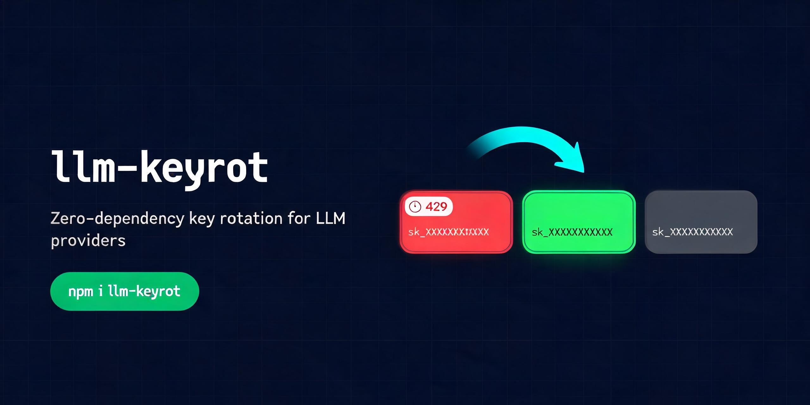

<div align="center">

# llm-keyrot

## 429 shouldn't crash your LLM app.

**Zero-dependency, in-process key rotation and provider failover for Node.js.**

**No proxy. No gateway. No runtime dependencies.**

`request → 429 → honor Retry-After → cooldown current key → rotate → retry → 200 OK`

[](https://github.com/caizefan34/llm-keyrot/actions/workflows/ci.yml)
[](https://www.npmjs.com/package/llm-keyrot)
[](https://www.npmjs.com/package/llm-keyrot)
[](LICENSE)
[](package.json)



</div>

`llm-keyrot` is a **provider-agnostic** helper for developers building LLM apps, batch jobs, agents, and eval scripts with Node.js.  
It keeps retry logic inside your process, with **no runtime dependencies** and **no external key gateway**.

## Why use it

- Your request hit `429` → respect `Retry-After`, cool down the current key, and rotate to another authorized key in the same provider.
- All keys are cooling down → wait for the earliest recovery instead of failing immediately.
- One provider is repeatedly rate-limited → temporarily route to a fallback provider/model.

## 30-second runnable demo (no real API key required)

```bash
node examples/mock-rotation-demo.js
node examples/mock-fallback-demo.js
node examples/anthropic-integration-demo.js
node examples/gemini-integration-demo.js
```

Both demos are deterministic and safe for a fresh clone.

---

## Table of contents

- [Install](#install)
- [Requirements and safety model](#requirements-and-safety-model)
- [Quickstart: minimal fetch integration](#quickstart-minimal-fetch-integration)
- [OpenAI SDK integration](#openai-sdk-integration)
- [Generic HTTP / axios style integration](#generic-http--axios-style-integration)
- [Cross-provider fallback route](#cross-provider-fallback-route)
- [Configuration reference](#configuration-reference)
- [Error handling, retry limit, and idempotency](#error-handling-retry-limit-and-idempotency)
- [llm-keyrot vs gateway](#llm-keyrot-vs-gateway)
- [When not to use llm-keyrot](#when-not-to-use-llm-keyrot)
- [Performance and behavior boundaries](#performance-and-behavior-boundaries)
- [Troubleshooting](#troubleshooting)
- [Security notes](#security-notes)
- [FAQ](#faq)
- [Docs and examples](#docs-and-examples)

## Install

```bash
npm install llm-keyrot
```

> If this package helps your production scripts, please consider starring the repo and using it from npm.

## Requirements and safety model

- **Node.js >= 18**
- **Pure ESM** (`"type": "module"`)
- **Zero runtime dependencies**
- `llm-keyrot` does **not** proxy network traffic and does **not** send your API keys to any external gateway.

## Quickstart: minimal fetch integration

```js
import { KeyRotator } from 'llm-keyrot'

let activeKey = process.env.OPENAI_API_KEY

const rotator = new KeyRotator({
  providers: {
    openai: {
      activeKey,
      pool: [process.env.OPENAI_KEY_2, process.env.OPENAI_KEY_3].filter(Boolean),
      cooldownMs: 30_000,
    },
  },
  onActivate(nextKey) {
    activeKey = nextKey
  },
})

async function callOpenAI(body) {
  const res = await fetch('https://api.openai.com/v1/chat/completions', {
    method: 'POST',
    headers: {
      Authorization: '******',
      'Content-Type': 'application/json',
    },
    body: JSON.stringify(body),
  })

  if (res.status === 429) {
    const action = await rotator.onRateLimit('openai', { status: 429 })
    if (action?.kind === 'retry') return callOpenAI(body)
  }

  return res.json()
}
```

## OpenAI SDK integration

```js
import OpenAI from 'openai'
import { KeyRotator } from 'llm-keyrot'
import { wrapOpenAI } from 'llm-keyrot/adapters/openai-node.js'

const client = new OpenAI({ apiKey: process.env.OPENAI_API_KEY })

const rotator = new KeyRotator({
  providers: {
    openai: {
      activeKey: process.env.OPENAI_API_KEY,
      pool: [process.env.OPENAI_KEY_2].filter(Boolean),
      cooldownMs: 30_000,
    },
  },
  onActivate(nextKey) {
    client.apiKey = nextKey
  },
})

wrapOpenAI(client, rotator, 'openai', { maxRetries: 3 })
```

## Generic HTTP / axios style integration

```js
import { KeyRotator } from 'llm-keyrot'
import { createRetryInterceptor } from 'llm-keyrot/adapters/http-interceptor.js'

const rotator = new KeyRotator({
  providers: {
    providerA: {
      activeKey: process.env.PROVIDER_A_KEY,
      pool: [process.env.PROVIDER_A_KEY_2].filter(Boolean),
      cooldownMs: 15_000,
    },
  },
  onActivate() {},
})

const sendWithRetry = createRetryInterceptor(
  rotator,
  'providerA',
  async (url, options) => {
    const res = await fetch(url, options)
    return {
      status: res.status,
      headers: Object.fromEntries(res.headers),
      body: await res.json(),
    }
  },
  { maxRetries: 3 }
)
```

## Cross-provider fallback route

```js
import { KeyRotator } from 'llm-keyrot'

const rotator = new KeyRotator({
  providers: {
    openai: { activeKey: 'k1', pool: ['k2'], cooldownMs: 1000 },
    anthropic: { activeKey: 'a1', pool: ['a2'], cooldownMs: 1000 },
  },
  fallbacks: {
    openai: { provider: 'anthropic', model: 'claude-3-5-sonnet' },
  },
  onActivate() {},
})

await rotator.onRateLimit('openai', { status: 429 })
await rotator.onRateLimit('openai', { status: 429 })
await rotator.onRateLimit('openai', { status: 429 })

console.log(rotator.getRoute('openai', 'gpt-4o-mini'))
// -> { provider: 'anthropic', model: 'claude-3-5-sonnet' }
```

## Configuration reference

### `new KeyRotator(options)`

| Field | Type | Required | Notes |
| --- | --- | --- | --- |
| `providers` | `Record<string, { activeKey: string, pool?: string[], cooldownMs?: number }>` | yes | provider map |
| `fallbacks` | `Record<string, { provider: string, model: string }>` | no | fallback route map |
| `onActivate` | `(nextKey: string) => void \| Promise<void>` | yes | set active key in your client/env |
| `onDeactivate` | `(prevKey: string) => void \| Promise<void>` | no | called after successful rotation |
| `logger` | `{ info?: Function, warn?: Function }` | no | defaults to `console` |

### Methods

- `await rotator.onRateLimit(provider, failure, signal?)`
  - handles `status: 429` and common rate-limit codes.
  - supports `failure.providerRetryAfterMs` for server hints.
  - returns `{ kind: 'retry' }` or `undefined`.
- `rotator.getRoute(provider, model)` → resolved provider/model with fallback applied.
- `rotator.isInFallback(provider)` → whether provider is in fallback mode.
- `rotator.dispose()` → cancel fallback timers and waiting cooldown retries.

## Error handling, retry limit, and idempotency

- `createRetryInterceptor(..., { maxRetries })` and `wrapOpenAI(..., { maxRetries })` enforce a maximum retry count.
- `Retry-After` is parsed from:
  - `retry-after-ms`
  - `retry-after` seconds
  - `retry-after` HTTP-date
- Non-rate-limit errors (for example `500`, auth errors, validation errors) are **not swallowed**.
- Retrying can re-send requests; only auto-retry idempotent operations unless your application can tolerate duplicates.

## llm-keyrot vs gateway

- Use **llm-keyrot** when your app only needs **in-process retry, cooldown, API-key rotation, and optional provider fallback**.
- Use an **LLM gateway** when you need **centralized billing, governance, observability, or cross-service coordination**.

## When not to use llm-keyrot

- You need centralized cross-team quota governance, billing aggregation, or policy enforcement at the gateway layer.
- You must coordinate key state across many independent processes/hosts via shared storage.
- You cannot accept any automatic retries in your workflow.

## Performance and behavior boundaries

- Rotation state is in-process memory only.
- Rotation is serialized per provider to avoid concurrent key activation races.
- Cooldown hints are clamped to a safe range in core logic.
- Fallback mode auto-recovers after a timer; it is not a permanent circuit breaker.

## Troubleshooting

- **No rotation happens**: ensure your code calls `onRateLimit` on 429 or mapped rate-limit failures.
- **Wrong key still used**: verify `onActivate` actually updates the key used by your HTTP client/SDK.
- **Unexpected retries**: lower `maxRetries` in adapters or call `dispose()` when shutting down.
- **Import errors**: this package is ESM only. Use `import`, not `require`.

## Security notes

- Never commit real API keys.
- Avoid logging full keys; only log masked key ids.
- See [SECURITY.md](./SECURITY.md) for reporting guidance.

## FAQ

**Does llm-keyrot send keys to an external service?**  
No. It is in-process logic only.

**Can I use it without OpenAI SDK?**  
Yes. The core `KeyRotator` works with any HTTP client.

**Will it retry every error automatically?**  
No. Adapters retry only rate-limit failures up to `maxRetries`.

## Docs and examples

- [Quickstart guide](./docs/quickstart.md)
- [Discovery metadata suggestions (topics/about)](./docs/discovery.md)
- [Deterministic key-rotation demo](./examples/mock-rotation-demo.js)
- [Deterministic fallback demo](./examples/mock-fallback-demo.js)
- [Deterministic Anthropic integration demo](./examples/anthropic-integration-demo.js)
- [Deterministic Gemini integration demo](./examples/gemini-integration-demo.js)
- [Legacy real-provider standalone example](./examples/standalone.js)

## License

MIT
